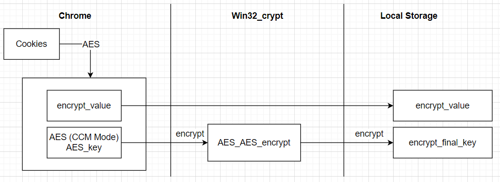
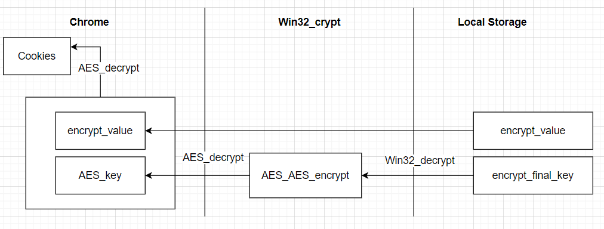

# Chờ rom Protect

### Plugin Chrome để bảo vệ cookies
#### Chức năng

- Export Cookies
- Import Cookies
- Tạo mật khẩu bảo mật cho cookies (mã hóa AES)
- Tự động refresh mỗi khi nhập cookies

### Sơ đồ mã hóa?
                            Sơ đồ mã hóa cookies 

                            Sơ đồ giải mã cookies 

### Cài đặt

**Các bước để cài đặt extension :**

- Clone repo này `git clone https://github.com/nguyenvuong1122000/chrome-cookies-`

- Vào trang extension của google chrome :  `chrome://extensions/` và kích hoạt Developer mode.

- Click  `load unpacked` và chọn folder code .

### Tham khảo
- Tài liệu chi tiết về chương trình [ở đây](link báo cáo)
- [How to install a Chrome extension without using the Chrome Web Store](https://blog.hunter.io/how-to-install-a-chrome-extension-without-using-the-chrome-web-store-31902c780034)
- Tìm hiểu về  [**HTTP Cookies**](https://developer.mozilla.org/en-US/docs/Web/HTTP/Cookies).
- Video demo chương trình ở [đây]() : 

